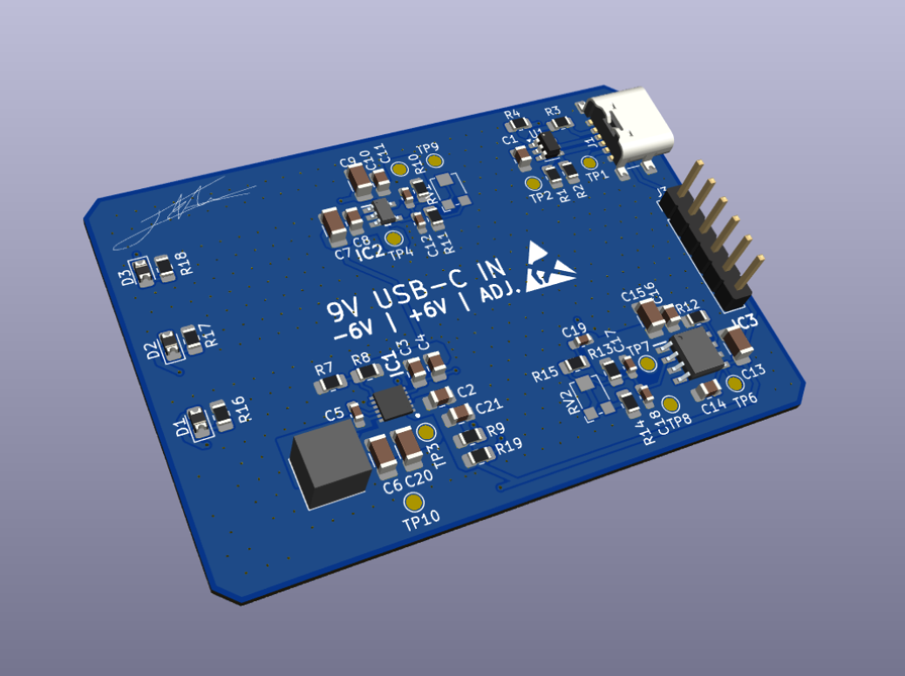
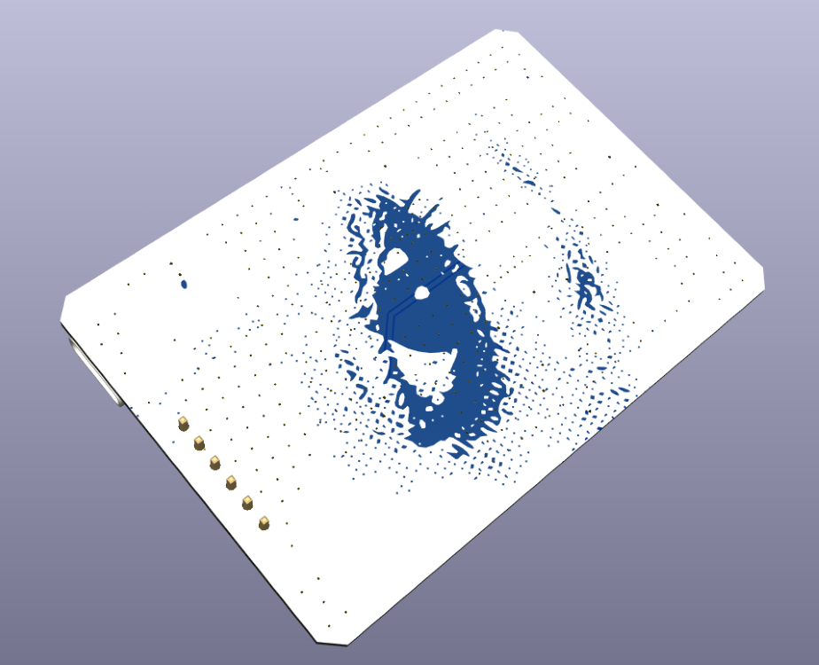

# Dual-Rail-Power-Supply
A low-noise power supply designed around the usage with audio circuits and low power applications. This power supply,
once polished, will hopefully be used for a audio devlopment board I have in the works.

### Skills Used for Project
***Analog Circuit Design, KiCad, LTSPICE, Hand/Hot Air Soldering, Component Selection***

  
  

# Design (V1.0.0)
The power Supply is based around Analog Devices **MAX17577/8+**, along with their low-noise linear regulators, the **ADP7182** and **ADP7102**.
I chose these components as it was my first approach at designing such a project, and these components were easy to work with and could
be simulated using **LTSPICE**. The board featues a USB-C 3.0 Female Port for power input where a USB PD chip (**CH221K**) communicates with
PD compatible devices to negotiate power delivery. The device is desgined to negotiate for 9V DC from the USB-C port, and delivers that to
the switiching DC-DC inverter and the linear positive regulator.

The board comes with 3 indicator LED's to let the user know the status of the various power rails (9V In, -6V, +6V). Additionally, because this
board is a work in progress prototype, I have opted for header pins as the output ports to supply power output for testing. Furthermore, there are
testpoint pads located where important signals come from so low-interference testing can be preformed.

## MAX17577/8+
The **MAX17577/8** are a series of high efficiency, synchronous switching DC-DC inverted converters. This chip is able to produce anywhere from -4.5V
to -60V DC. For this project, I have opted for the **MAX17578** for its DCM (Discontinuous Conduction Mode) as DCM converters tend to preform better
in transient responses, and in lighter loads. However, the drawback from this approach is potential additional EMI (Electromagentic Interference). The
PCB was designed with this is mind as I tried to place this converter as far from the linear regulators as I could, along with the noisiest part, the inductor.

The converter takes a 9V input and is configured using a resistor divider to output -6V at roughly 0.8A max. This output is slighly choppy at times,
so it is then fed into a linear regulator (**ADP7182**) where it can then be smoothed out

## ADP7182/02
To provide stable and low-noise power rails, I opted for the **ADP7182/02** for the negative rail and positive rail respectively. The dropoff voltage is
relatively low, and thus I found the associated power loss from these chips to be small. Each chip is limited to 200mA, which is suitable for the application
in mind. Additionally, to help stabilize rails and reduce noise, input and output capacitors have been added for each regulator in values of 10uf, and 2.2uf.
This choice was suggested by Analog Devices datasheets for each device, along with a group of series capacitors in parallel with the feedback resistors at
a value of 220pf.

# Testing

# Notes
